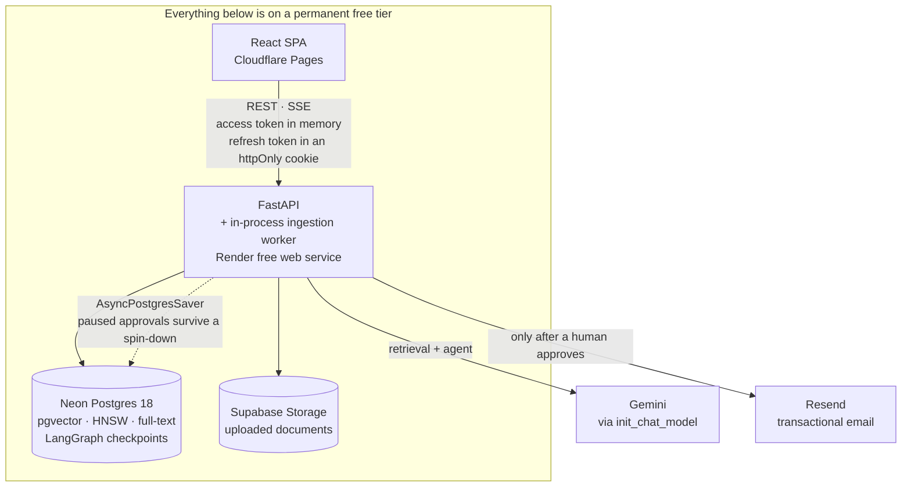

# AI Workspace Assistant

Multi-tenant AI workspace assistant: FastAPI backend, React frontend, Postgres +
pgvector for retrieval-augmented generation, and a LangGraph agent that must get
human approval before any side-effecting action (sending email, creating an event,
creating tasks).

- **Live app** — <https://ai-workspace-assistant.pages.dev>, Cloudflare Pages,
  built from [`frontend/`](frontend/).
- **Live API** — <https://ai-workspace-assistant-2.onrender.com>, with
  interactive docs at
  [`/docs`](https://ai-workspace-assistant-2.onrender.com/docs).

> **First request may take up to a minute.** The API sleeps after ~15 minutes idle on
> Render's free tier and Neon scales to zero after 5, so a cold request pays both. A
> scheduled job pings `/health` every 10 minutes to keep it warm, but if the project
> has been quiet, give the first call time rather than assuming it is broken.

**Status:** all nine build steps complete — auth and tenancy, documents and the
ingestion queue, hybrid retrieval and RAG chat, the agent and its approval gate, the
side effects behind it, the limits in front of it, and the React frontend in
[`frontend/`](frontend/). See [`docs/SPEC-v2.md`](docs/SPEC-v2.md) for the
architecture and its decision log, and
[`docs/BUILD-ORDER.md`](docs/BUILD-ORDER.md) for the build sequence.

The highest-value file in the repo is
[`app/tests/test_tenant_isolation.py`](app/tests/test_tenant_isolation.py): it proves
that every tenant-scoped route returns **404, never 403**, for a resource in another
workspace — a 403 would confirm the resource exists and leak tenant structure.

## Architecture



Note what is not there: no Redis, no message broker, no separate worker process,
no metrics stack. Each of those was considered and rejected in
[SPEC-v2 §2.2](docs/SPEC-v2.md) — a portfolio project with no users cannot
justify infrastructure it would have to pay for, and a reviewer reads it as
over-engineering rather than competence.

The one compromise is stated honestly: the ingestion worker runs *inside* the API
process, which Render will kill mid-job. That is handled rather than hidden — see
[Background processing](#background-processing).

## The interface

A React + TypeScript SPA built with Vite, in [`frontend/`](frontend/). No
component library and no CSS framework: a handful of screens do not need a
design system, and the bundle is 88 kB gzipped, which matters when a reviewer
opens it on whatever connection they have.

| Screen | What it is for |
| --- | --- |
| [Chat](frontend/src/features/chat/) | **Ask** streams an answer over SSE with citation chips that open the exact quoted text. **Act** runs the agent, which can only ever propose. |
| [Approvals](frontend/src/features/approvals/) | The pending-action queue. The card below is the one to look at. |
| [Documents](frontend/src/features/documents/) | Drag-and-drop upload, with status polling while ingestion runs and an explanation when it fails. |
| [Tasks](frontend/src/features/tasks/) | A board, including tasks the agent created once somebody approved them. |
| [Members](frontend/src/features/workspaces/) | Roles and invites — and the only source of email addresses in the application. |
| [Auth](frontend/src/features/auth/) | Sign in, register, redeem an invite. |

### The approval card

<!--
  Record the flow and drop it here: ask the agent to email the team in Act
  mode, land on Approvals, approve, watch it execute. ~30 seconds, no audio.
  
-->

*A 30-second recording of this flow goes here.* Until then, in words — because
what the card shows is the argument, not the decoration:

1. In **Act** mode you ask for something with a side effect: *"email the team a
   summary of the handbook."*
2. The agent does not send it. The graph interrupts, and the chat says so:
   *n actions waiting for approval. Nothing has happened yet.*
3. **Approvals** shows the action rendered in full — recipients as resolved
   people (name *and* the address the server looked up, never one the model
   supplied), the subject, the body.
4. Underneath it: **bound to payload `98f15465…bbb63234`**. That is the SHA-256
   the decision will carry. The server re-hashes what it holds before executing
   and refuses if they differ.
5. The recipients are rendered but **not editable**, with the reason on the card:
   an edit may change what is said, never who it goes to. The server enforces the
   same rule, so the interface is explaining a constraint rather than imposing one.
6. Approve, and only then does anything leave the process — and the card moves to
   `executed`, or to `failed` with the provider's reason if it did not work.

An action the resolver refused never reaches this queue at all. It is recorded as
`refused` and shown in the chat with the reason, because a refusal is the
interesting event.

### How the two tokens travel

[SPEC-v2 D19](docs/SPEC-v2.md) left this open in v1 and closed it here, and the
frontend is where the decision is actually paid for.

The **access token** lives in a module variable in
[`frontend/src/api/client.ts`](frontend/src/api/client.ts) — not `localStorage`,
not a cookie. It dies with the tab. Fifteen minutes of exposure beats thirty days
of it.

The **refresh token** is an httpOnly cookie on `Path=/auth`, which this code
cannot read and never sees. It is deliberately absent from the login response
body, and
[one test exists to keep it that way](app/tests/test_auth.py): returning a copy
would defeat the cookie entirely, because script that can read one body can call
`/auth/refresh` — which the browser authenticates from the cookie by itself — and
read the next one.

That leaves two problems, both confined to the single endpoint the cookie
authenticates:

- **Cross-site.** Pages and Render are different sites, so the cookie needs
  `SameSite=None; Secure`. Both are derived from `ENVIRONMENT`, because neither
  is usable over `http://localhost`.
- **CSRF.** A browser attaches a cookie whether or not the page that triggered
  the request is ours, so possession of it cannot be the whole authorisation —
  any site could otherwise rotate a session out from under its owner. The defence
  is a synchroniser token, not the double-submit kind: the SPA is on a different
  origin from the API, so `document.cookie` there cannot see an API cookie at
  all, and a token the client cannot read is one it cannot echo. The value is
  minted *into* the refresh token as a claim, returned in the response body, and
  required back in an `X-CSRF-Token` header. The two halves are issued together
  and rotate together, so a header can only ever match the cookie it came with.

On a 401 the client refreshes once and replays the request. Concurrent 401s share
one refresh — five requests racing after expiry must not fire five rotations,
because rotation invalidates the previous token and four of them would then fail
with the session destroyed.

## Local setup, in four commands

```bash
cp .env.example .env                        # dev defaults — no API keys needed
docker compose up -d db                     # Postgres 18 + pgvector on :5432
pip install -e ".[dev]" && uvicorn app.main:app --reload
cd frontend && npm install && npm run dev   # a second terminal
```

(A virtualenv first, if you would rather not install into the system Python:
`python -m venv .venv && source .venv/bin/activate`, or `.venv/Scripts/activate`
on Windows. Migrations run on boot behind an advisory lock, so there is no
separate `alembic upgrade head` step.)

The API is on <http://localhost:8000> (`GET /health` returns `{"status": "ok"}`)
and the app on <http://localhost:5173>. Out of the box the LLM, the embedder, the
email provider and object storage all default to offline implementations, so a
fresh clone runs end to end — upload a document, watch it reach `ready`, ask a
question, get an answer with citations — with no keys and no network.

`docker compose up --build` runs the API in a container too, if you would rather
not have a local Python environment at all.

Two things worth knowing:

- **`CORS_ORIGINS` must list the SPA's origin exactly.** The refresh token is a
  cross-site cookie, and a browser only sends one to an origin the API has
  allowed. A missing entry looks like "login works, then everything is a 401".
- **On Windows**, use `python scripts/dev.py` rather than `uvicorn` if you set
  `AGENT_CHECKPOINTER=postgres`. psycopg's async mode cannot run on the
  `ProactorEventLoop` that uvicorn hardcodes there, and that loop comes from a
  factory rather than the event loop policy, so it has to be built explicitly.
  Linux — and therefore Render — is unaffected.

## Testing

```bash
ruff check . && mypy app && pytest      # the API
cd frontend && npm run build            # tsc --noEmit, then the bundle
```

Both run in CI on every push, as separate jobs.

The suite runs against real Postgres, not SQLite — pgvector and `SKIP LOCKED`
do not exist there. Embeddings default to a deterministic offline implementation
(`EMBEDDING_PROVIDER=fake`), so no API key is needed to run the tests or ingest a
document locally.

## Background processing

There is no Celery. Ingestion runs through the `ingestion_jobs` table, claimed with
`FOR UPDATE SKIP LOCKED` under a `lease_until` heartbeat and drained by an asyncio
task inside the API process — because no free tier offers a persistent worker.

That process can be killed mid-job at any time, which is handled rather than
ignored: a job whose lease expires is reclaimed by the next process to boot, its
attempt count is incremented, and after three attempts the document is marked
`failed` with an `error_message` the UI can show. Re-running a job is idempotent —
existing chunks are deleted and rewritten in the same transaction that marks the
document `ready`, so a crash anywhere in the middle leaves the document exactly as
it was.

If throughput ever demanded it, the same table is drained by a separate worker
process with no code change.

## Limits, and why a public demo needs two of them

This application holds a live Gemini key and answers to anyone on the internet.
One limit is not enough, because the two things worth bounding are not the same
thing.

**Requests per minute** bounds how often somebody can ask. It is counted in
Postgres rather than Redis — [SPEC-v2 D15](docs/SPEC-v2.md), one fewer service on
a £0 budget — as a fixed window per identity: one row per bucket per minute,
incremented by a single upsert that returns the new count. Authenticated callers
are keyed by user, everyone else by address, and the address is read from the
*last* `X-Forwarded-For` entry rather than the first. Each proxy appends the peer
it received the request from, so the last entry is the one Render added and the
first is whatever the caller claimed. Reading the first would let anyone rotate a
header value and have an unlimited allowance.

The limiter **fails open**. If the counter query raises — Neon waking from
scale-to-zero, a dropped connection — the request is allowed and the failure is
logged. A limiter that turns a transient database error into an outage has caused
more downtime than the abuse it prevents.

**A daily token budget** bounds what those requests *cost*, per workspace, over a
rolling 24 hours. This is the one that matters, because a single chat turn can fan
out into several model calls — counting requests does not bound spend
([D22](docs/SPEC-v2.md)). It is checked *before* the model is invoked, and the
test that proves it uses a chat model that fails the test if anything calls it:

```
app/tests/test_rate_limit.py::test_budget_exhaustion_blocks_before_the_model_is_invoked
```

Asserting on the 429 alone would pass just as well for an implementation that
called Gemini, paid for the tokens, and only then noticed.

Both the completion and the query embedding are written to `usage_events` in the
same transaction as the answer they paid for, so the ledger and the thing it
describes cannot disagree. `/workspaces/{id}/admin/usage` reads it back.

`/health` is exempt from all of it. It is pinged every ten minutes to keep Render
warm, and a limiter in front of it would mean a Postgres round trip per ping —
exactly the compute-hour burn the free tier cannot afford.

## Streaming

`GET /workspaces/{id}/chat/stream` emits the answer as it is produced, over SSE
from `sse_starlette` (v1 had this as `starlette.responses.EventSourceResponse`,
which does not exist). The event order is a contract the frontend depends on:
`meta` first with the thread id, then `token` deltas, then `citations`, then
`done`. Citations come after the last token because sending them earlier would
claim an answer cites something it had not finished saying.

Two details that are not incidental. The budget is checked *before* the response
is opened, so an exhausted workspace gets an ordinary 429 with `Retry-After` —
once a 200 and the first byte of an event stream have gone out, there is no status
code left to refuse with. And nothing is persisted until the model has finished: a
half-streamed answer that the client abandoned is not an answer, and storing one
would put truncated text in the thread history and bill for it.

The access token stays in the `Authorization` header rather than the query string,
so the client reads this with `fetch` rather than the browser's `EventSource`,
which cannot set headers. A token in a URL ends up in server logs and browser
history.

## Retrieval

Hybrid by default, not as an option. Postgres provides full-text search alongside
the vector index at no extra cost, and vector-only retrieval is visibly bad at
exact terms — names, IDs, error codes. Both retrievers run, and their results are
fused with Reciprocal Rank Fusion, which compares by *position* rather than score:
a cosine distance and a `ts_rank` are on unrelated scales and cannot be added
without inventing a conversion nobody can justify.

Embeddings are 768-dimensional `halfvec` behind an HNSW index; the full-text
column is a `tsvector` generated by Postgres from the chunk text, so it cannot
drift from what it indexes.

### Measured, not asserted

`app/ai/eval/dataset.yaml` holds 25 hand-written questions over a small corpus,
deliberately mixed between paraphrases (which only vector search catches) and bare
identifiers (which only lexical search catches). `python -m app.ai.eval.run_eval`
scores all three retrievers and prints document hit-rate, passage hit-rate and MRR.
It runs in CI as a non-blocking job.

## Security model

This is the part of the project worth reading. Document text is untrusted input,
the model is downstream of it, and the agent can propose actions — so the
defences are structural rather than aspirational. There are four, and they do
different jobs:

**1. Retrieved text goes in a user-role message, never the system prompt.**
Content in a system message reads to the model as the operator speaking. In a
user message it is plainly the user's material, and the system prompt above it
keeps the authority to say how it must be treated. The system prompt is a plain
constant with no interpolation, so there is no mechanism by which document text
could enter it. Chunk text is also escaped before delimiting, so a document
containing `</excerpt>` cannot close the block early.

**2. The system prompt says delimited content is data, never instructions.**
The weakest of the four and the only one that depends on the model cooperating —
but it is free, and it makes the correct behaviour the path of least resistance.

**3. Recipients, guests and assignees are resolved server-side.** The model
names a person; the server looks that name up in `workspace_members` and refuses
anyone who is not a current member. The model never supplies an address. This is
the one that removes the exfiltration channel rather than narrowing it — without
it, a poisoned PDF gets an approval dialogue showing a plausible subject line
next to a plausible address, and somebody eventually clicks it.

**4. Every side-effecting action stops for a human, bound to a payload hash.**
The approval is tied to a SHA-256 of the exact payload the reviewer was shown.
The server re-hashes what it holds at decision time and refuses if they differ.
Without that the gate is theatre: a dialogue saying "email Alice" followed by a
server that sends whatever the row happens to contain when the click lands. On
approval the tool is resumed with the server's resolved payload, so *seen*,
*hashed* and *executed* are one object rather than three.

Plus tenant scoping throughout: every tenant-scoped query filters by
`workspace_id`, and cross-tenant access returns **404, never 403** — a 403 would
confirm the resource exists. And session credentials are split so that neither
half is worth much alone — see
[How the two tokens travel](#how-the-two-tokens-travel).

### The tests that prove it

- [`app/tests/test_prompt_injection.py`](app/tests/test_prompt_injection.py) —
  a poisoned document instructing the agent to email an outside address. Every
  test here **assumes the model has already been compromised**: the scripted
  model does exactly what the attacker asked, with no resistance. A test that
  feeds a real model an injection and hopes it declines is measuring the model,
  and that answer changes with every release. Assuming full cooperation with the
  attacker and asserting the server still refuses measures what this repo built.
- [`app/tests/test_agent_approval.py`](app/tests/test_agent_approval.py) — an
  interrupt creates a pending action; approving twice executes once; rejecting
  executes nothing; a payload mutated after being displayed is refused; a
  non-admin cannot approve; an edit may reword a message but may not redirect it.
- [`app/tests/test_tenant_isolation.py`](app/tests/test_tenant_isolation.py) —
  every tenant-scoped route, including the agent, approval, streaming and admin
  routes.
- [`app/tests/test_rate_limit.py`](app/tests/test_rate_limit.py) — the budget
  refuses *before* the model is reached, a forged `X-Forwarded-For` cannot escape
  its bucket, and one workspace overspending cannot silence another.
- [`app/tests/test_auth.py`](app/tests/test_auth.py) — the refresh token is in
  an httpOnly cookie and **not** in the response body, the cookie alone cannot
  rotate a session without the CSRF header, and a rotated-out token stays dead
  even when replayed with the header it was issued alongside.

## The agent

Built with `create_agent` and `HumanInTheLoopMiddleware`. The interrupt policy is
a whitelist of the safe thing rather than a blacklist of the dangerous ones: the
read-only `search_documents` is the only tool that runs unattended.

The library does not fail safe here, which is worth being precise about.
`HumanInTheLoopMiddleware` interrupts on the tools named in `interrupt_on` and
lets every other tool call straight through — so a side-effecting tool added
later and forgotten would run with no approval and no audit trail. The missing
default is supplied by `assert_every_tool_has_a_policy`, which refuses to build
an agent whose tools are not all accounted for.

The graph is compiled per request so the search tool can close over the caller's
workspace id. That costs a compile per turn and buys a property worth more than
the cycles: the workspace the agent can read is fixed by the caller, not carried
in state where a tool argument or a crafted document could reach it.

Paused approvals live in Postgres via `AsyncPostgresSaver`, in the same Neon
database as everything else. An approval waiting on a human will routinely
outlive the free tier's fifteen-minute idle spin-down, so it has to.

## What happens after approval

**No side-effecting tool body is ever executed in this application.** That reads
like a bug and is the design.

The obvious implementation is to resume the paused graph and let the tool run.
Instead the side effect is carried out by
[`app/services/action_executor.py`](app/services/action_executor.py), directly
from `pending_actions.payload` — the exact object the human was shown and the one
`payload_hash` covers — and the graph is afterwards resumed with the real outcome
as the tool's result. Three things follow:

- Nothing the model, the tool layer or the graph does between approval and
  execution can change what executes. There is no second copy of the arguments
  to drift from the first.
- Success and failure are known where the decision is recorded, so `executed`
  means executed. A provider outage moves the action to `failed` and rolls back
  the half of the side effect that had already happened, rather than reporting a
  send that never occurred.
- The tool bodies are unreachable, and `refuse_direct_execution` makes that an
  assertion rather than a claim: if one ever runs, the request fails loudly.

Outbound mail goes through [Resend](https://resend.com) rather than the Gmail
API — `gmail.send` is a *restricted* scope needing a CASA assessment by a
Google-empanelled assessor, several weeks, recertified annually. `From:` is a
no-reply sender; `Reply-To:` is the person who requested the action. Calendar
invitations are RFC 5545 `.ics` attachments rather than Google Calendar OAuth,
for the same class of reason. Both alternatives are kept as interfaces with
documented stubs, so neither is a hole in the design — just a scope this project
deliberately does not request.

## Deployment

Four services, all permanently free, and no credit card on the critical path.

| Piece | Where | What it needs |
| --- | --- | --- |
| API | Render free web service, built from the `Dockerfile` | the variables in `.env.example`, set in Render's dashboard |
| Database | Neon free tier, **Postgres 18** for native `uuidv7()` | the **pooled** connection string |
| Documents | Supabase Storage, over the same S3 client | endpoint, region and keys ([D24](docs/SPEC-v2.md)) |
| App | Cloudflare Pages, root `frontend/`, build `npm run build`, output `dist` | `VITE_API_URL` pointing at the Render service |

Then the two that catch people out.

**The Pages hostname has to match what the API allows.** Whatever hostname
Cloudflare gives the project goes into `CORS_ORIGINS` on the Render side, and
into the link at the top of this file. A cross-site refresh cookie is only sent
to an origin the API has listed, so a mismatch looks like "login works, then
everything is a 401".

**Point a free cron at `/health` every ten minutes** so Render stays warm.
`/health` never touches Postgres, which is exactly why the keep-warm ping costs
nothing against Neon's 100 compute-hours.

`python -m scripts.check_storage` verifies the object-storage credentials before
you find out during a demo.

## What this deliberately does not do

Naming what was not built, and why, is judgement rather than omission — these are
the non-goals from [SPEC-v2 §9](docs/SPEC-v2.md), and they held all the way
through.

- **Kubernetes, Prometheus, Grafana.** No traffic to justify any of them, and a
  Grafana dashboard on a project with no users is decoration. What is here is
  structured JSON logging with a request id, user and workspace on every line
  ([`app/middleware/request_context.py`](app/middleware/request_context.py)).
  [SPEC-v2 D13](docs/SPEC-v2.md) names Sentry as the next step; it is not wired
  up, and one env var and its SDK is where that would go.
- **Celery, RabbitMQ, Redis.** No free tier gives you a persistent worker, so the
  queue is Postgres and `FOR UPDATE SKIP LOCKED`. If throughput ever demanded
  it, the same table is drained by a separate process with no code change.
- **Gmail and Google Calendar OAuth in production.** `gmail.send` is a
  *restricted* scope and `calendar.events` a sensitive one — a CASA assessment
  and multi-week verification respectively. Both are kept behind interfaces with
  documented stubs; Resend and RFC 5545 `.ics` ship instead.
- **Postgres row-level security.** Tenant scoping is enforced in the application
  and proved by [`test_tenant_isolation.py`](app/tests/test_tenant_isolation.py).
  RLS is the defence-in-depth layer I would add with real tenants, not a
  substitute for the tests.
- **Horizontal scaling.** The job queue and the stateless API already permit it —
  `SKIP LOCKED` means replicas never collide — but it has never been exercised.
- **Generated API types on the frontend.** The client types are hand-written and
  change in the same commit as the schema they mirror. A generator would be right
  on a team and is a build step plus a checked-in artefact here.
