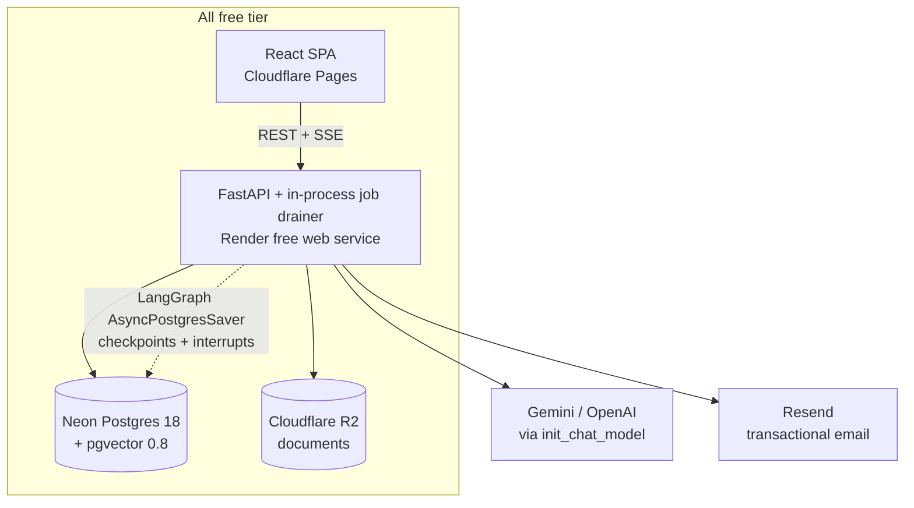

# AI Workspace Assistant — Revised Specification (v2)

**Revision date:** 22 August 2026
**Supersedes:** original project blueprint (v1)
**Target profile:** portfolio / job-application project, deployed publicly on free tiers

---

## 0. Why this revision exists

The v1 blueprint is architecturally sound and the security reasoning behind the
human-in-the-loop design is genuinely correct. Three things needed fixing:

1. **The deployment plan cannot be built.** It assumes free infrastructure that no
   longer exists (Fly.io free allowance, Railway free tier) and specifies a service
   list — Celery, RabbitMQ, Redis, MinIO, Prometheus, Grafana, optional Kubernetes —
   that costs real money every month and that a reviewer will read as
   over-engineering on a project with no users.
2. **Two integrations are dead ends.** `gmail.send` is a *restricted* scope: shipping
   it publicly requires a CASA security assessment by a Google-empanelled assessor,
   takes several weeks, and must be recertified annually. That is not a thing you
   complete before a placement deadline.
3. **The data model contradicts itself** in four places and would not survive being
   written as SQLAlchemy models without decisions being made.

Everything below is the v1 design with those corrected. **No feature has been
removed.** The agent, the HITL approval gate, the RAG pipeline, multi-tenancy,
RBAC, audit logging and streaming all remain. What changed is how they are
realised.

---

## 1. The constraint that drives every decision

This is a **portfolio project on free hosting**. That single fact should be applied
ruthlessly:

| Priority | Implication |
| --- | --- |
| A reviewer spends ~4 minutes on your repo | The README, a live URL and one architecture diagram matter more than a Grafana dashboard nobody opens |
| It must be publicly reachable | Cold starts must be documented, not hidden |
| £0/month | Every service must have a permanent free tier, not a trial credit |
| It must survive a stranger poking at it | A public LLM key without hard caps is a way to receive a surprise bill |
| Depth beats breadth | One correct, tested, genuinely multi-tenant feature outranks six half-wired ones |

**The single most impressive thing in this project is the security model** — untrusted
document content, prompt injection, and an agent that is architecturally forbidden
from acting without human approval. Build the README around that, not around the
feature list.

---

## 2. Decision log — what changed and why

### 2.1 Data model

| # | v1 said | v2 says | Why |
| --- | --- | --- | --- |
| D1 | Separate `embeddings` table, 1:1 with `document_chunks` | `document_chunks.embedding halfvec(768)` — table dropped | A 1:1 side table buys nothing and forces a join on the hottest query in the app. Also halves storage, which matters at 0.5 GB. |
| D2 | Integer primary keys | `UUID` (UUIDv7) primary keys | Workspace and document IDs appear in URLs. Sequential integers let anyone enumerate `/workspaces/1..n` and leak how many tenants exist. UUIDv7 keeps index locality, unlike UUIDv4. **Select Postgres 18 when creating the Neon project** — it has a native `uuidv7()`, so the default can live in the database rather than in application code. |
| D3 | `tasks.assigned_to → workspace_members.id` | `tasks.assigned_to → users.id`, plus a validation that the user is a member of that workspace | Membership rows get deleted and recreated when someone leaves and rejoins. Tasks would break or silently reattach to the wrong person. |
| D4 | ERD: `CHAT_MESSAGES ||--o{ TASKS` | `tasks.source_message_id` — nullable FK, `ON DELETE SET NULL` | The relation was never explained in v1. What was meant is provenance: "this task came from that agent turn." |
| D5 | `chat_msg_chunks(chat_id, chunk_id, score)` | `message_citations` with its own PK **and a denormalised `quoted_text` snapshot** | Citations must survive document deletion. If a doc is deleted, the citation currently becomes a dangling FK and the chat history silently loses its evidence. |
| D6 | `workspace_invites.token` | `token_hash` (SHA-256), raw token returned once at creation | An invite token is a bearer credential. Storing it in plaintext means a DB read is a free pass into every workspace. Same reasoning as password hashing. |
| D7 | — | New table: `ingestion_jobs` | Required once Celery is dropped (see D12). Gives durable status, retry counts and a resume-after-restart story. |
| D8 | — | New table: `usage_events` | Rate limiting per workspace and cost caps need somewhere to count. Also feeds `/admin/usage`, which v1 specified but gave no data source for. |
| D9 | `documents(id, workspace_id, name, file_path, ...)` | Adds `content_hash`, `mime_type`, `size_bytes`, `chunk_count`, `error_message` | `content_hash` deduplicates re-uploads (free tier storage is 0.5 GB). `error_message` is what the UI shows when ingestion fails, which v1 had no field for. |
| D10 | — | Unique constraint `oauth_credentials(user_id, service)`; `users.email` stored lower-cased with a unique index | Otherwise `Nalin@x.com` and `nalin@x.com` are two accounts, and a user can accumulate duplicate Google credentials. |

### 2.2 Infrastructure

| # | v1 said | v2 says | Why |
| --- | --- | --- | --- |
| D11 | Celery + Redis + optional RabbitMQ | **Postgres-backed job queue** using `SELECT ... FOR UPDATE SKIP LOCKED`, drained by an asyncio task in the API process | No free tier gives you a persistent background worker. Render workers start at $1/mo and need a paid Redis. A Postgres queue is ~80 lines, needs zero new infrastructure, and gives durable retry for free. It is also a better interview answer than "I added Celery." |
| D12 | MinIO / S3 | **Cloudflare R2** (10 GB free, zero egress) | MinIO needs a server to run on. R2's free tier is permanent and egress is free at any volume, which matters because documents get downloaded. |
| D13 | Prometheus + Grafana dashboards | Structured JSON logs + Sentry free tier; Prometheus listed as an explicit non-goal | Grafana Cloud on a project with no traffic is decoration. Sentry actually catches the errors a reviewer might trigger. |
| D14 | Fly.io / Railway / Render / VPS / Kubernetes | **Render free web service + Neon free Postgres + Cloudflare Pages + Cloudflare R2** | Fly.io removed its free allowance; new accounts pay from the first machine. Railway has no free tier, only a one-time $5 trial credit. Render's free web instance (512 MB, 0.1 CPU) is the only permanent free container of the three. |
| D15 | Redis for rate limiting | Postgres-backed counters at MVP; Render Key Value (25 MB free) only if genuinely needed | One less service. At portfolio traffic a Postgres counter is not the bottleneck. |

### 2.3 Integrations

| # | v1 said | v2 says | Why |
| --- | --- | --- | --- |
| D16 | Gmail API with `gmail.send` | **Resend / Brevo free tier**, `From:` a no-reply address, `Reply-To:` the requesting user. Gmail kept behind an `EmailProvider` interface but not shipped | `gmail.send` is restricted: CASA assessment by a Google-empanelled assessor, several weeks, annual recertification. v1 already identified this escape hatch — v2 takes it as the default rather than the fallback. |
| D17 | Google Calendar OAuth | **Generate an `.ics` invitation** as the default, attached to the notification email. Google Calendar OAuth optional, in testing mode | `calendar.events` is a sensitive scope; verification has been reported taking 5+ weeks. Testing mode allows up to 100 test users, which is plenty for a demo — but `.ics` works for everyone with no OAuth at all and demonstrates the same agent flow. |
| D18 | OpenAI or Gemini | **Provider-agnostic** via `init_chat_model`, defaulting to **Gemini** | You expressed no preference. Gemini's free tier is the only one that lets a public demo run at £0. One env var swaps it. |

### 2.4 Security

| # | v1 said | v2 says | Why |
| --- | --- | --- | --- |
| D19 | "httpOnly cookies **or** localStorage" | **Decided:** access token in memory (JS variable), refresh token in an httpOnly cookie with rotation | Leaving this open would have blocked the first frontend file. Frontend on Cloudflare Pages and API on Render are different sites, so a cookie needs `SameSite=None; Secure` — which then needs CSRF defence. Keeping only the *refresh* token in the cookie confines that problem to one endpoint. |
| D20 | HITL approval gate | Approval is bound to a **hash of the exact payload the human was shown**; the server re-validates on approve | This is the actual hole in v1. If the payload can change between "here is the email we will send" and "approved", the approval gate is theatre. The pending action stores `payload_hash`; approving with a different payload is rejected. |
| D21 | Tools "should validate inputs" | **Recipients are never taken from model output.** The model names members; the server resolves names to addresses from `workspace_members` and refuses anything not in that set | The model is downstream of untrusted document text. If it can emit an arbitrary email address, a poisoned PDF has an exfiltration channel — the approval dialogue would just show a plausible-looking address. |
| D22 | Rate limit requests/minute | Requests/minute **and** a per-workspace daily token budget | One chat request can fan out to many LLM calls. Counting requests does not bound cost. |
| D23 | "Strictly validate file types" | Validate by **magic bytes**, not extension; cap size; cap per-workspace document count | Extension checking is not validation. |

---

## 3. Revised architecture



Note what is **not** there: no Redis, no message broker, no separate worker dyno, no
object-storage container, no metrics stack. Every box is permanently free.

### The one architectural compromise, stated honestly

The ingestion worker runs **inside** the API process. On Render's free tier the
service spins down after ~15 minutes idle, which can kill a job mid-flight. This is
handled, not ignored:

- Jobs live in `ingestion_jobs` with a `lease_until` timestamp and a heartbeat.
- A job whose lease expires is reclaimed by the next process that boots.
- `attempts` is incremented; after N attempts the document is marked `failed` with
  `error_message` set, and the UI shows it.
- A free external cron (cron-job.org or a GitHub Actions schedule) pings `/health`
  every 10 minutes so the service is usually warm.

Write this in the README. "I chose a Postgres queue over Celery because the free
tier has no persistent worker, and here is how I made it crash-safe" is a strong
answer. Pretending the problem does not exist is not.

---

## 4. Revised data model

All tenant-scoped tables carry `workspace_id`. Primary keys are `UUID` (v7).

| Table | Fields | Changes from v1 |
| --- | --- | --- |
| `users` | `id`, `email` (unique, lower-cased), `password_hash`, `name`, `is_active`, `created_at` | email normalised |
| `workspaces` | `id`, `name`, `owner_id→users`, `created_at` | — |
| `workspace_members` | `id`, `workspace_id`, `user_id`, `role` enum(`admin`,`member`,`viewer`), `joined_at`; unique `(workspace_id, user_id)` | viewer role promoted from "optional" to defined |
| `workspace_invites` | `id`, `workspace_id`, `email`, **`token_hash`**, `invited_by`, `status`, `expires_at`; unique `(workspace_id, email)` where status = pending | **D6** |
| `documents` | `id`, `workspace_id`, `name`, `storage_key`, **`content_hash`**, **`mime_type`**, **`size_bytes`**, `uploaded_by`, `uploaded_at`, `status` enum(`pending`,`processing`,`ready`,`failed`), **`chunk_count`**, **`error_message`** | **D9** |
| `document_chunks` | `id`, `document_id`, `workspace_id`, `text`, `page_no`, `chunk_index`, **`embedding halfvec(768)`**, **`tsv tsvector`** | **D1** + full-text column for hybrid search |
| ~~`embeddings`~~ | — | **removed (D1)** |
| `chat_threads` | `id`, `workspace_id`, `user_id`, `title`, `created_at` | `title` added for a usable sidebar |
| `chat_messages` | `id`, `thread_id`, `workspace_id`, `user_id`, `role` enum(`user`,`assistant`,`tool`), `content`, `created_at` | `is_bot` bool → `role` enum; a tool message is neither |
| `message_citations` | `id`, `message_id`, `chunk_id` (nullable, `ON DELETE SET NULL`), `document_name`, **`quoted_text`**, `score` | **D5** |
| `tasks` | `id`, `workspace_id`, `title`, `description`, `assigned_to→users`, **`source_message_id`**, `status`, `due_date`, `created_at` | **D3, D4** |
| `calendar_events` | `id`, `workspace_id`, `title`, `start_time`, `end_time`, `created_by`, `ics_uid`, `external_event_id` (nullable) | supports both `.ics` and Google paths |
| `oauth_credentials` | `id`, `user_id`, `service`, `refresh_token_enc`, `scopes`, `expires_at`; unique `(user_id, service)` | **D10** |
| `pending_actions` | `id`, `workspace_id`, `thread_id`, `type`, `payload` jsonb, **`payload_hash`**, `status`, `initiated_by`, `decided_by`, `decided_at`, `created_at` | **D20** |
| `audit_log` | `id`, `workspace_id`, `user_id`, `action`, `details` jsonb, `created_at` | jsonb rather than text, so it is queryable |
| `ingestion_jobs` | `id`, `workspace_id`, `document_id`, `status`, `attempts`, `lease_until`, `last_error`, `created_at` | **new (D7)** |
| `usage_events` | `id`, `workspace_id`, `user_id`, `kind`, `tokens_in`, `tokens_out`, `created_at` | **new (D8)** |

**Indexes to create explicitly** (Alembic will not guess these):

```sql
CREATE INDEX ON document_chunks USING hnsw (embedding halfvec_cosine_ops)
  WITH (m = 16, ef_construction = 64);
CREATE INDEX ON document_chunks USING gin (tsv);
CREATE INDEX ON document_chunks (workspace_id);
CREATE INDEX ON chat_messages (thread_id, created_at DESC);
CREATE INDEX ON documents (workspace_id, uploaded_at DESC);
CREATE INDEX ON ingestion_jobs (status, lease_until);
```

### Storage budget — this is a hard limit, not a guideline

Neon's free tier is **0.5 GB per project**, and a pgvector HNSW index can run
**4–5× the size of the table it indexes**.

- 768-dim `halfvec` = 1,536 bytes per chunk
- plus chunk text (~1 KB) and the HNSW index
- ≈ **8–10 KB all-in per chunk**

That is roughly **25,000–30,000 chunks**, or on the order of **500–800 typical
documents**, before the free tier is exhausted. Enforce a per-workspace document cap
in code and say so in the UI. Do not discover this in a demo.

This is also why the embedding is 768-dim and `halfvec` rather than 1536-dim
`vector`: it is a 4× storage reduction for a negligible recall difference.

---

## 5. AI layer — verified APIs

Version-checked against PyPI on 22 August 2026.

```
langchain==1.3.16          # >=1.3.3 required for `when` predicates on interrupts
langgraph==1.2.11
langchain-google-genai==4.3.5
pgvector==0.5.0
sse-starlette==3.4.8       # NOT starlette.responses — v1 had this wrong
fastapi==0.141.1
sqlalchemy==2.0.52
pydantic==2.13.4
alembic==1.19.1
```

**Correction to v1:** the blueprint said SSE comes from
`starlette.responses.EventSourceResponse`. That class does not exist there — it is
`from sse_starlette.sse import EventSourceResponse`, a separate package.

### Agent construction

```python
from langchain.agents import create_agent
from langchain.agents.middleware import HumanInTheLoopMiddleware
from langgraph.checkpoint.postgres.aio import AsyncPostgresSaver
from langgraph.types import Command

agent = create_agent(
    model=init_chat_model(settings.llm_model),   # provider-agnostic (D18)
    tools=[search_documents, draft_email, draft_event, create_tasks],
    middleware=[
        HumanInTheLoopMiddleware(
            interrupt_on={
                "send_email":    {"allowed_decisions": ["approve", "edit", "reject"]},
                "create_event":  {"allowed_decisions": ["approve", "edit", "reject"]},
                "create_tasks":  {"allowed_decisions": ["approve", "reject"]},
                "search_documents": False,        # read-only, auto-approve
            },
            description_prefix="This action needs your approval",
        ),
    ],
    checkpointer=checkpointer,
)
```

Resume with `Command(resume={"type": "approve"})`, `{"type": "edit",
"edited_action": {...}}`, or `{"type": "reject", "message": "..."}`. Every invocation
passes `config={"configurable": {"thread_id": str(thread.id)}}`.

`AsyncPostgresSaver` writes its checkpoint tables into the same Neon database — no
extra service, and a pending approval survives the free tier spinning down, which is
exactly the property you need.

### Embeddings

Default: **`gemini-embedding-2`** with `output_dimensionality=768`. It supports
128–3072 dimensions with 768 among the recommended values, and — unlike the earlier
`gemini-embedding-001` — it **renormalises automatically** for non-default
dimensions, so you do not have to normalise truncated vectors yourself. Getting that
wrong is a classic silent-recall bug, so pin the model name explicitly rather than
letting it float.

OpenAI equivalent, if you swap providers: `text-embedding-3-small` with
`dimensions=768`.

Store as `halfvec(768)` either way. Changing embedding model or dimension is a
migration plus a full re-embed, so decide once, in Phase 2, and record the model name
on the `documents` row so a future re-index knows what produced what.

### Retrieval — hybrid, because it is free

v1 listed hybrid search as optional. Make it the default: Postgres gives you
full-text search at no extra cost, and vector-only retrieval is visibly bad at exact
terms (names, IDs, error codes).

Run both, fuse with Reciprocal Rank Fusion, take top-N. Query parameters:
`SET LOCAL hnsw.ef_search = 60` — the useful range is 40–200, and values much above
that can flip the planner to a sequential scan.

### Prompt-injection defence (concrete, not aspirational)

1. Retrieved chunks go in a **user-role** message inside explicit delimiters, never
   in the system prompt.
2. The system prompt states that delimited content is data to be quoted, never
   instructions to be followed.
3. **Recipients, assignees and event guests are resolved server-side** from
   `workspace_members`. The model emits names; the server maps them. Anything
   unresolvable is refused (D21).
4. Every side-effecting tool interrupts for human approval, and the approval is
   bound to a payload hash (D20).

Point 3 is the one that actually stops exfiltration. Points 1–2 raise the bar; point
4 catches what gets through; point 3 removes the channel.

---

## 6. Background processing — the Postgres queue

Replaces Celery entirely.

```sql
UPDATE ingestion_jobs
SET status = 'running',
    lease_until = now() + interval '5 minutes',
    attempts = attempts + 1
WHERE id = (
    SELECT id FROM ingestion_jobs
    WHERE status = 'pending'
       OR (status = 'running' AND lease_until < now())   -- reclaim crashed jobs
    ORDER BY created_at
    FOR UPDATE SKIP LOCKED
    LIMIT 1
)
RETURNING *;
```

An `asyncio` task started in the FastAPI lifespan polls this every few seconds.
`SKIP LOCKED` means multiple instances never collide, so this scales to several
replicas unchanged if you ever move off the free tier.

Upgrade path, for the README: *"if throughput demanded it, the same job table is
drained by a separate worker process with no code change; Celery becomes a
one-file swap."* That sentence is worth more than actually having installed Celery.

---

## 7. Deployment — corrected

### Stack

| Component | Service | Free tier | Notes |
| --- | --- | --- | --- |
| Frontend | Cloudflare Pages | unlimited sites, generous bandwidth | Vercel is equivalent |
| API | Render free web service | 512 MB RAM, 0.1 CPU, $0 | **spins down after ~15 min idle** |
| Database | Neon | 0.5 GB storage, 100 CU-hours/month | pgvector included on free; scale-to-zero after 5 min |
| Documents | Cloudflare R2 | 10 GB, 1M Class A + 10M Class B ops, **zero egress** | egress stays free at any volume |
| Email | Resend or Brevo | free tier sufficient for a demo | replaces Gmail (D16) |
| LLM | Gemini | free tier | swap via one env var |
| Errors | Sentry | free tier | replaces Prometheus/Grafana |
| Keep-warm | cron-job.org or GitHub Actions | free | pings `/health` every 10 min |

**Total: £0/month.** No credit card required for the critical path.

### Free-tier gotchas — every one of these will bite you

1. **Double cold start.** Render spins down at ~15 min idle, Neon scales to zero at
   5 min. The first request after a quiet period pays both. Expect ~30–60s. Put a
   line in the README: *"first load may take up to a minute — free tier cold start."*
   A reviewer who sees that reads it as awareness. A reviewer who does not read it
   thinks the app is broken.
2. **Connection pooling is mandatory.** Neon scale-to-zero plus SQLAlchemy's default
   pool will produce intermittent connection errors. Use Neon's **pooled** connection
   string, and set `pool_size=2, max_overflow=3, pool_pre_ping=True,
   pool_recycle=300`. On 512 MB you cannot afford a big pool anyway.
3. **100 CU-hours/month.** Scale-to-zero is what keeps you inside it. Do not add a
   cron that pings the *database* every minute — pinging the API is fine, because
   `/health` should not touch Postgres. Make `/health` a pure in-process response.
4. **0.5 GB ceiling.** See §4. Cap documents per workspace in code.
5. **Migrations run on boot, carefully.** With one instance, `alembic upgrade head` in
   the startup path is acceptable. Guard it with an advisory lock so it stays correct
   if you ever run two instances.
6. **Secrets in Render's dashboard**, never in the repo. Add `.env` to
   `.gitignore` before the first commit, not after. A leaked Gemini key in git
   history is a bad thing for a public portfolio repo to contain.

### Abuse and cost guardrails — non-negotiable for a public demo

A public app holding your LLM key is an open invitation.

- Per-workspace daily token budget, enforced before the LLM call, returning 429.
- Per-IP registration limit.
- Upload size cap (5 MB) and per-workspace document cap.
- A read-only demo account seeded with sample documents, so a reviewer can look
  around without registering.
- Gemini free tier has its own rate limits — surface a clean "busy, try again"
  rather than a 500.

### Docker

Keep `docker-compose.yml` for local development — Postgres+pgvector and the API. It
is what makes the repo clone-and-run, which is worth real marks. It is **not** the
production deployment; Render builds from the Dockerfile directly.

### CI

GitHub Actions on push: `ruff` → `mypy` → `pytest`. Cheap, visible as a green badge,
and the absence of it is noticed.

---

## 8. Revised build sequence

Reordered so that something is **publicly deployed in week one**. A half-built
project with a live URL beats a fully-built one on localhost.

**Phase 0 — deploy a skeleton (day 1–2).**
`/health` endpoint, Dockerfile, Render + Neon + Pages wired, CI green, README stub.
Deployment problems found on day 2 are annoyances; found in week 6 they are a crisis.

**Phase 1 — auth and tenancy.**
Config, models, Alembic, JWT, register/login/me, workspaces, members, invites, RBAC
dependencies. **Write the tenant-isolation tests here** — a member of workspace A must
receive 404, not 403, for anything in workspace B. This test file is the single most
persuasive thing in the repo.

**Phase 2 — documents and RAG.**
Upload to R2, `ingestion_jobs` queue, chunk, embed, HNSW index, hybrid retrieval,
`/chat/query` with citations. No agent yet.

**Phase 3 — the agent and the approval gate.**
LangGraph, `AsyncPostgresSaver`, tools, `HumanInTheLoopMiddleware`, `pending_actions`
with payload hashing, approve/reject/edit endpoints, SSE streaming, audit log.

**Phase 4 — polish for the audience.**
Tasks CRUD, `.ics` calendar, Resend email, rate limits and token budgets, seeded demo
account, README with architecture diagram and a short screen recording, RAG evaluation
set (see below).

### Two additions worth more than another feature

- **A RAG evaluation set.** 20–30 hand-written questions with expected answers and
  expected source documents, run as a pytest job reporting retrieval hit-rate. Almost
  nobody does this at portfolio level, and it is the difference between "I used
  LangChain" and "I measured my retrieval."
- **A prompt-injection test.** A deliberately poisoned document that instructs the
  agent to email an external address, plus a test asserting the recipient resolver
  refuses it. That test *is* your security section.

---

## 9. Explicit non-goals

State these in the README. Naming what you did not build, and why, reads as judgement
rather than omission.

- Kubernetes, Prometheus, Grafana — no traffic to justify them.
- Celery/RabbitMQ — the Postgres queue is sufficient at this scale; upgrade path documented.
- Gmail / Google Calendar OAuth in production — restricted and sensitive scopes with
  multi-week verification; abstracted behind interfaces instead.
- Postgres RLS — application-level tenant scoping plus isolation tests. Mention RLS as
  the defence-in-depth step you would add with real tenants.
- Horizontal scaling — the job queue and stateless API already permit it; not exercised.

---

## 10. Unchanged from v1

Kept as specified: the module/file layout, the router and endpoint surface, the RBAC
model, the audit-log approach, the SSE-over-WebSockets decision, the RAG pipeline
stages, en-GB spelling throughout, and the overall reasoning that document content is
untrusted input and no LLM output may trigger an outbound call unreviewed.

That last point is the spine of the project. Everything in this revision was chosen to
keep it intact while making the thing actually deployable.
